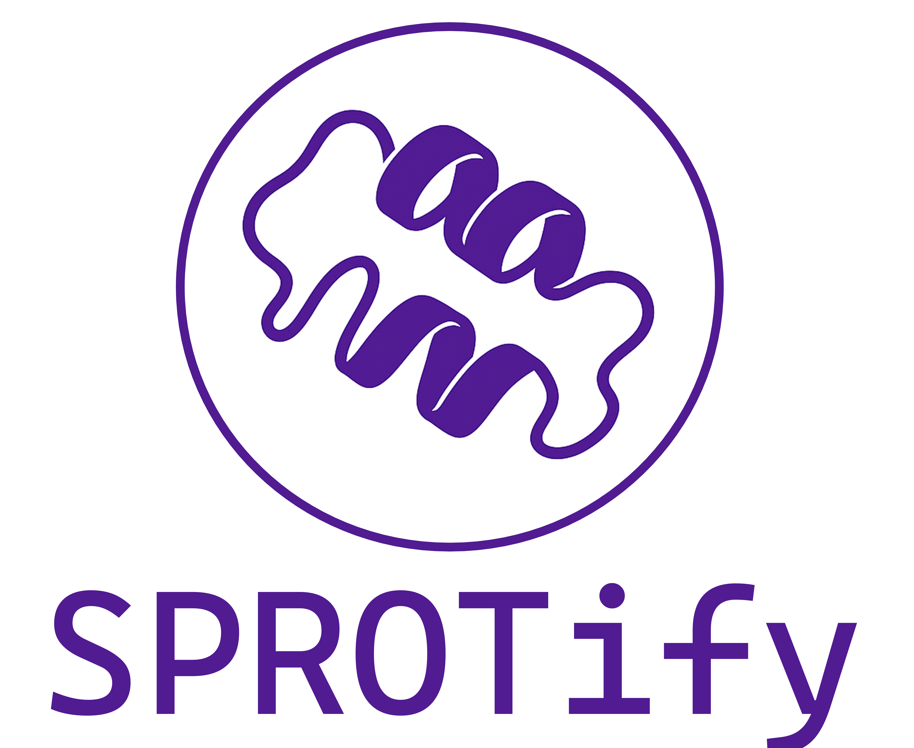

<div align="center">

</div>

# SPROTify

SPROTify is a machine learning–based tool for accurate small-protein prediction using features derived from amino acid sequences and secondary structure information. Small proteins have emerged as important regulators in diverse biological processes, including signal transduction, metabolism, stress response, and disease progression. However, many remain unannotated or experimentally uncharacterized due to their short length and low abundance.
SPROTify is trained on a curated dataset of experimentally validated small proteins, with multiple algorithms assessed through 5-fold cross-validation and further optimized via hyperparameter tuning.
The tool integrates five classification models—LGBMClassifier, BaggingClassifier, XGBClassifier, ExtraTreesClassifier, and SVC—allowing users to select the most suitable model based on their analytical goals.
By enabling accurate identification of small proteins, SPROTify supports research into their potential roles in disease mechanisms, regulatory pathways, and condition-specific biological functions.

SPROTify includes two main modules:

- **Small protein prediction**: Predict small proteins directly from amino acid sequences. 
- **Model training**: Train and test models on custom datasets while evaluating and comparing performance across models.

## Installation

1. Download SPROTify and install required Python packages (Python 3.9+)

```bash
# clone the repository
git clone https://github.com/CSBM-Lab/SPROTify.git
cd SPROTify

# Install dependencies
pip install -r requirements.txt
```

2. Install s4pred

```bash
git clone https://github.com/psipred/s4pred.git
```

3. SPROTify requires a modified version of s4pred. After cloning the original repository, copy the patched files from `tools/` to overwrite the originals.

```bash
cp tools/run_model.py s4pred/
```

## Input file

SPROTify accepts a FASTA file as input, which can contain either DNA or amino acid sequences.

```text
>seq1
MTHHPISDHEATLRCWALGFYPVEITLTQ
>seq2
MAIRGPAALSAALYLH
```
 
If users want to perform model training, a separate CSV file containing labels is required. The file should follow the format below:

```csv
id,label
seq1,positive
seq2,negative
```

The column names **id** and **label** are fixed. The **id** must correspond to the headers in the FASTA file, while the **label** is used to distinguish positive and negative samples.
Users can either provide separate FASTA and CSV files for the training and test sets, or supply a single FASTA and CSV file, in which case SPROTify will randomly split the data into training and test sets.

## SPROTify's commands

### Prediction
This module is for the prediction based on constructed models. Execution requires only a single step.

```bash
python scripts/model_predict.py --input INPUT_FASTA_PATH --output OUTPUT_PATH
```

**Required arguments**

- `--input`: Path to the input FASTA file 
- `--output`: Path to the output file. If the output folder does not exist, it will be created automatically.

**Additional arguments**

- `--model-type`: Model type (options: `xgb`, `lgbm`(default), `ada`, `rf` or `et`)
- `--model-path`: Path to trained model file
- `--n-jobs`: Number of parallel jobs (default: 1, use -1 for all)

If `--model-type` and `--model-path` both are assigned, only `--model-path` will take effect.

**Example**

Perform prediction using default lightgbm model. The example files used below are stored in the **dataset** directory.

```bash
python scripts/model_predict.py --input dataset/test_set.fasta --output model_result/lgbm_testing.csv
```

If users want to use other model, just need to specify `--model-type`.

```bash
# Using xgboost model
python scripts/model_predict.py --model-type xgb --input dataset/test_set.fasta --output model_result/xgb_testing.csv
# Using adaboost model  
python scripts/model_predict.py --model-type ada --input dataset/test_set.fasta --output model_result/ada_testing.csv
```

SPROTify also supports multi-threaded execution; the number of threads can be specified using `--n-jobs`, where `-1` indicates that all available CPU threads will be used.

```bash
# Use all threads for faster prediction
python scripts/model_predict.py --model-type xgb --input dataset/test_set.fasta --output model_result/xgb_testing.csv --n-jobs -1
```

### Training and evaluation (train a model with user data)

If users wish to customize their own prediction models with their own datasets, this module can be used.

Depending on the machine learning algorithm selected, SPROTify provides different scripts for users. The paths to each program are listed below:

- `scripts/train_lightgbm.py` (recommended, fastest and also precise)
- `scripts/train_xgboost.py`
- `scripts/train_adaboost.py`
- `scripts/train_randomforest.py`
- `scripts/train_extratrees.py`

Additionally, depending on whether the training and test sets are provided separately or a single dataset is supplied for SPROTify to randomly split, two modes (**auto mode** and **manual mode**) are available.

#### 1. Auto mode (default)
Automatically splits your data into training and test sets. Training and model building can also be done in a single step.

```bash
python scripts/train_lightgbm.py --input INPUT_FASTA_PATH --label_csv INPUT_LABEL_PATH 
```

**Required arguments**

- `--input`: Path to the input FASTA file
- `--label-csv`: Path to the label CSV file with columns `id` and `label`

**Additional arguments**

- `--test-ratio`: Proportion of data for testing (default: 0.2)
- `--tune`: Enable hyperparameter optimization using [Optuna](https://github.com/optuna/optuna)
- `--n-trials`: Number of [Optuna](https://github.com/optuna/optuna) optimization trials (default: 300; only used when `--tune` is enabled)
- `--run-baseline`: Perform model comparison across all methods provided by [LazyPredict](https://github.com/shankarpandala/lazypredict) without hyperparameter tuning
- `--save-model`: Save the trained model for later prediction
- `--n-jobs`: Number of parallel jobs (default: 1, use -1 for all cores)
- `--mode`: Dataset assignment methods (options: `auto` (default), `manual`)

**Example**

Using default lightgbm model to train the data. 
The following example demonstrates how to build the model with SPROTify randomly splitting the input dataset, 
corresponding to the `--mode auto` setting. 
Since `--mode` defaults to `auto`, the `--mode auto` is omitted in the commands below.
The example files used below are stored in the **dataset** directory.

```bash
python scripts/train_lightgbm.py --input dataset/full_dataset.fasta --label-csv dataset/full_true_labels.csv --save-model
```

Users can also select other models to train the data.

```bash
# Using xgboost model
python scripts/train_xgboost.py --input dataset/full_dataset.fasta --label-csv dataset/full_true_labels.csv --save_model

# Using adaboost model
python scripts/train_adaboost.py --input dataset/full_dataset.fasta --label-csv dataset/full_true_labels.csv --save-model
```
By default, 80% of the dataset is used for training and 20% for testing. Users can modify this ratio using the `--test-ratio`.

```bash
# Custom training/test set split (90/10)
python scripts/train_lightgbm.py --input dataset/full_dataset.fasta --label-csv dataset/full_true_labels.csv --test-ratio 0.1 --save-model
```

If users want to perform hyperparameter tuning during model training, they can enable `--tune` and set `--n-jobs` and `--n-trials`. However, please note that this will significantly increase the runtime.

```bash
python scripts/train_xgboost.py --input dataset/full_dataset.fasta --label-csv dataset/full_true_labels.csv --tune --n-trials 100 --save-model --n-jobs -1
```

SPROTify also provides an fucntion (`--run-baseline`) that allows users to train and test models using all algorithms available in [LazyPredict](https://github.com/shankarpandala/lazypredict).
This script outputs the accuracy of each machine learning method.
Please note that these results are intended only for preliminary comparison of different algorithms, 
have not undergone hyperparameter optimization, and the `--save-model` function will not be executed.

```bash
# Preliminary evaluation only, no model will be built
python scripts/train_lightgbm.py --input dataset/full_dataset.fasta --label-csv dataset/full_true_labels.csv --run-baseline
```

#### 2. Manual mode

Train and build models based on user-defined training and test sets. 
Training and model building can also be done in a single step. 
All the functionalities available in **auto mode** can also be executed in **manual mode**. 
Users only need to provide the separate training and test dataset files and set the `--mode` to `manual`.

```bash
python scripts/train_lightgbm.py --mode manual \
  --train-fasta TRAIN_FASTA_PATH --train-label-csv TRAIN_LABEL_PATH \
  --test-fasta TEST_FASTA_PATH --test-label-csv TEST_LABEL_PATH
```

**Required argument**
- `--train-fasta`: Path to the training FASTA file
- `--train-label-csv`: Path to the training label CSV file
- `--test-fasta`: Path to the testing FASTA file
- `--test-label-csv`: Path to the testing label CSV
- `--mode`: Dataset assignment methods (options: `auto` (default), `manual`).

**Additional arguments**
- `--tune`: Enable hyperparameter optimization using Optuna
- `--n-trials`: Number of Optuna optimization trials (default: 300; only used when `--tune` is enabled)
- `--run-baseline`: Run baseline model comparison using LazyPredict
- `--save-model`: Save the trained model for later prediction
- `--n-jobs`: Number of parallel jobs (default: 1, use -1 for all cores)

**Example**

Using default lightgbm model to train the data. The example files used below are stored in the **dataset** directory.

```bash
# Train and save lightgbm model
python scripts/train_lightgbm.py --mode manual \
  --train-fasta dataset/train_set.fasta --train-label-csv dataset/train_true_labels.csv \
  --test-fasta dataset/test_set.fasta --test-label-csv dataset/test_true_labels.csv \
  --save-model
```

Users can also select other models to train the data.

```bash
# Using xgboost model
python scripts/train_xgboost.py --mode manual \
  --train-fasta dataset/train_set.fasta --train-label-csv dataset/train_true_labels.csv \
  --test-fasta dataset/test_set.fasta --test-label-csv dataset/test_true_labels.csv \
  --save-model

# Using adaboost model
python scripts/train_adaboost.py --mode manual \
  --train-fasta dataset/train_set.fasta --train-label-csv dataset/train_true_labels.csv \
  --test-fasta dataset/test_set.fasta --test-label-csv dataset/test_true_labels.csv \
  --save-model
```

If users want to perform hyperparameter tuning during model training, they can enable `--tune` and set `--n-jobs` and `--n-trials`. However, please note that this will significantly increase the runtime.

```bash
python scripts/train_xgboost.py --mode manual \
  --train-fasta dataset/train_set.fasta --train-label-csv dataset/train_true_labels.csv \
  --test-fasta dataset/test_set.fasta --test-label-csv dataset/test_true_labels.csv \
  --tune --n-trials 100 --save-model --n-jobs -1
```

Same as **auto mode**, users can also perform preliminary comparison of different algorithms provided by [LazyPredict](https://github.com/shankarpandala/lazypredict). Please note that these results are intended only for preliminary comparison of different algorithms, 
have not undergone hyperparameter optimization, and the `--save-model` function will not be executed.

```bash
# Preliminary evaluation only, no model will be built
python scripts/train_lightgbm.py --mode manual \
  --train-fasta dataset/train_set.fasta --train-label-csv dataset/train_true_labels.csv \
  --test-fasta dataset/test_set.fasta --test-label-csv dataset/test_true_labels.csv \
  --run-baseline
```
